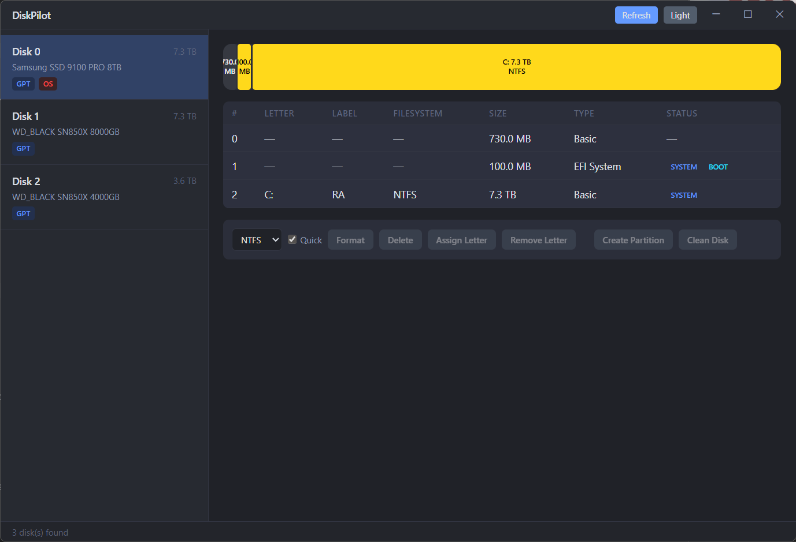

<p align="center">
  
</p>

<h1 align="center">DiskPilot</h1>

<p align="center">
  <strong>Manage your drives without the bloatware.</strong><br/>
  A free, lightweight disk and partition manager for Windows. No ads, no upsells, no 200 MB installer.
</p>

<p align="center">
  <a href="https://github.com/LordVelm/diskpilot/releases/latest"></a>
  <a href="https://github.com/LordVelm/diskpilot/blob/master/LICENSE"></a>
  
</p>

---

<!-- TODO: Add screenshots
<p align="center">
  
</p>
-->

## What It Does

DiskPilot shows all your drives and partitions in a clean visual layout, and lets you manage them: format, delete, create, clean, and change drive letters. Think of it as the disk management tool Windows should have shipped.

**Why not Disk Management (diskmgmt.msc)?** It works, but the UI is from 2006.

**Why not MiniTool / EaseUS / AOMEI?** They're bloated, nagware, and half the features are locked behind a paywall.

DiskPilot does the same job in a single-file app under 5 MB.

## Features

- **Visual partition bar** with proportional, color-coded segments (click to select)
- **Full disk overview** with model, size, GPT/MBR, removable/system badges
- **Format** with filesystem choice (NTFS, FAT32, exFAT) and quick/full toggle
- **Create, delete, clean** with type-to-confirm safety dialogs
- **Assign / remove drive letters** with cross-disk collision detection
- **Dark and light themes**

## Safety First

This app can destroy data. So it's built with defense-in-depth:

1. **System disk locked down** — Cannot clean, format, or delete partitions on your Windows drive. Both the UI buttons AND the backend independently refuse.
2. **Protected partitions** — EFI, Recovery, MSR, and boot partitions are visible but untouchable on the system disk.
3. **Type-to-confirm** — Every destructive operation requires typing the exact confirmation text (e.g., `CLEAN DISK 1`).
4. **Fails closed** — If the app can't determine which disk is the system disk, all destructive operations are refused. It won't guess.
5. **Concurrent operation guard** — Only one disk operation can run at a time. No accidental double-clicks.
6. **Input sanitization** — All user input is sanitized before reaching diskpart to prevent command injection.

## Download

**[Download the latest release](https://github.com/LordVelm/diskpilot/releases/latest)** (Windows installer)

The app requires administrator privileges for disk operations. Windows will show a UAC prompt on launch.

Or build from source:

```bash
cd diskpilot
npm install
npx tauri build
```

## How It Works

| Layer | What it does |
|-------|-------------|
| **WMI** (read) | Enumerates disks and partitions via `Win32_DiskDrive`, `Win32_DiskPartition`, `Win32_LogicalDisk` |
| **diskpart** (write) | All mutations go through `diskpart /s` temp scripts with a 60-second timeout |
| **Safety gates** (Rust) | Every destructive command passes through `assert_not_system_disk` / `assert_not_system_partition` before executing |

### Partition Bar Colors

| Color | Meaning |
|-------|---------|
| Blue | NTFS (system/boot) |
| Green | NTFS (data) |
| Purple | FAT32 / exFAT |
| Dark gray | Unallocated / free space |
| Yellow | EFI / Recovery / MSR (protected) |

## System Requirements

- Windows 10/11
- Administrator privileges

## Built With

[Tauri v2](https://tauri.app/) + [React](https://react.dev/) + TypeScript + Rust

## License

[MIT](./LICENSE) — Created by [LordVelm](https://github.com/LordVelm)

## Feedback

- **Bug reports & feature requests** — [Open an issue](https://github.com/LordVelm/diskpilot/issues)
- **Support the project** — [Buy Me a Coffee](https://buymeacoffee.com/lordvelm)
